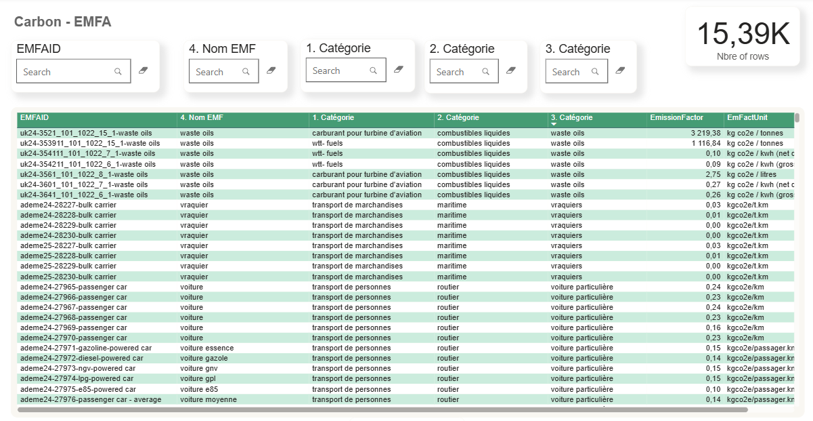

# 🌍 Carbon Emissions Automation

[](#license)
[](#api)
[](https://yassine123z-emissionfactor-mapper2.hf.space/)

> End-to-end pipeline that converts raw transaction & invoice data into activity-based CO₂e estimates using:
> - emission factor consolidation (ADEME / EXIOBASE / Climatiq, etc.)
> - data standardization (Power Query / Microsoft Fabric)
> - NLP-powered matching (Hugging Face + fine-tuning)
> - a lightweight FastAPI microservice
> - Power BI dashboards for exploration & reporting

---

## 📌 Table of Contents

- [Project Overview](#project-overview)
- [Why this project matters](#why-this-project-matters)
- [Tech Stack](#tech-stack)
- [Demo / Screenshots](#demo--screenshots)
- [Repository structure](#repository-structure)
- [Quickstart (run locally)](#quickstart-run-locally)
- [API examples](#api-examples)
- [How the matching works (high-level)](#how-the-matching-works-high-level)
- [Evaluation & Confidence](#evaluation--confidence)
- [Suggested 2–4 week pilot for Simple](#suggested-2-4-week-pilot-for-simple)
- [Roadmap & Production suggestions](#roadmap--production-suggestions)
- [Credits & data sources](#credits--data-sources)
- [Contact](#contact)
- [License](#license)

---

## 🧭 Project Overview

This prototype demonstrates a production-like flow for converting invoice/transaction text into estimated greenhouse gas emissions:

1. Collect and unify emission factors from multiple sources (ADEME, EXIOBASE, Climatiq).
2. Standardize and enrich the factor table (GHG protocol categories, ISO mapping, units).
3. Clean and normalize client transaction data with Power Query / Fabric.
4. Match transactions to emission factors using embeddings + a small re-ranker (Hugging Face models).
5. Expose matching as a FastAPI endpoint for integration.
6. Visualize transaction-level and aggregated emissions in Power BI.

**Goal:** demonstrate rapid, verifiable value — not full coverage. This repo is a conversation starter and a working demo you can run in ~30–60 minutes.

---

## 🔥 Why this project matters

- Most Scope 3 emissions are hidden in invoices and supplier data — manual mapping is slow and inconsistent.  
- This pipeline reduces manual effort and increases repeatability and explainability by combining deterministic rules with semantic matching.  
- The prototype shows a pragmatic path from raw data to decision-ready KPIs and dashboards.

---

## 🛠️ Tech stack

- **Language:** Python 3.10+  
- **API:** FastAPI + Uvicorn  
- **NLP & Embeddings:** Hugging Face Transformers, SentenceTransformers, sentence-transformers (`all-MiniLM` or similar)  
- **Vector search (demo):** FAISS or in-memory nearest neighbours  
- **Data processing:** pandas, Power Query (M) for Fabric / Power BI Dataflows  
- **Dashboard:** Power BI Desktop (.pbix) or screenshots for demo  
- **Persistence (demo):** Parquet / SQLite; prod -> PostgreSQL + Vector DB (Pinecone / Weaviate)  
- **Optional cloud:** Render, Railway, Azure App Service / Functions

---
## ⚙️ How the automation logic works

The pipeline automates CO₂e estimation in five layers, turning messy invoice/transaction data into decision-ready dashboards:

1. **Raw Data (input)**  
   - Invoices, ERP exports, procurement spreadsheets.  
   - Typically free-text descriptions + numeric values (e.g., *“Diesel fuel 20 L”*).  

2. **Standardization & Enrichment**  
   - Normalize units, currencies, and suppliers.  
   - Map transactions to activity categories (GHG protocol, ISO codes).  
   - Output: structured “activity data” ready for matching.  

3. **Emission Factor Consolidation**  
   - Merge multiple sources: ADEME, EXIOBASE, DEFRA, Climatiq.  
   - Harmonize units (kg, L, kWh, km).  
   - Attach metadata (scope, category, source reference).  

4. **Matching Engine (core logic)**  
   - **Rule-based:** direct matches via unit/type (e.g., *“20 L diesel” → fuel factor*).  
   - **Semantic/NLP:** embeddings compare text (*“fuel card” ≈ “diesel, passenger car”*).  
   - **Confidence scoring:** quantifies uncertainty and supports overrides.  

5. **Emission Calculation**  
   - Formula:  
     ```text
     Emissions (CO₂e) = Activity Data (quantity) × Emission Factor
     ```  
   - Automatic unit conversions (liters ↔ MJ ↔ kgCO₂e).  
   - Store transaction-level emissions for aggregation.  

6. **Outputs**  
   - **FastAPI microservice:** JSON responses with matches + emissions.  
   - **Power BI dashboards:** KPIs, supplier/category trends, audit trail.  
   - Every CO₂e number is traceable back to original data + factor.  

    
## 📷 Demo / Screenshots

> Replace these placeholders with your actual images / Loom links.

- `demo/invoice_parsed.png` — parsed invoice line items  
- `demo/api_response.png` — FastAPI JSON response sample  
-   — Power BI dashboard screenshot


---

## 🚀 Live Demo

Your API is already deployed here:  
👉 [Emission Factor Mapper API (FastAPI on Hugging Face Spaces)](https://yassine123z-emissionfactor-mapper2.hf.space/docs#/)

- Interactive docs: `https://yassine123z-emissionfactor-mapper2.hf.space/docs`
- Root endpoint health check: `https://yassine123z-emissionfactor-mapper2.hf.space/health`

---

## 📂 Repository structure

This repo contains both the **API** (FastAPI app) and supporting resources for ETL + dashboards.

